# 영화 평점 분석 · 보정 평점 기반 추천 (MovieLens)

[](https://github.com/jwoochoi2001/DA_Movielens-Rating-Explorer)
[](https://www.python.org/)
[](https://pandas.pydata.org/)
[](https://matplotlib.org/)
[](https://scikit-learn.org/)
[](https://streamlit.io/)
[](https://grouplens.org/datasets/movielens/)

**저장소**: <https://github.com/jwoochoi2001/DA_Movielens-Rating-Explorer>

---

## 개요

MovieLens 평점 데이터(`ml-latest-small`, 평점 10만 건 · 사용자 610명 · 영화 9,742편)로
**보고 싶은 영화를 추천받는 시스템**을 만드는 프로젝트다.
데이터 정제 → 파생변수 설계 → 영화별 평점 보정 → 추천 라벨 → Streamlit 대시보드까지를
`python run_all.py` 한 번으로 재현할 수 있는 파이프라인으로 구현했다.

핵심은 단순 평균 평점의 한계를 보완하는 것이다.

- 평점이 1~2개뿐인 영화가 평균 5.0으로 상위를 독식하는 문제
  → **베이지안 보정 평점(`bayesian_rating`)** 으로 표본이 적은 영화를 전역 평균 쪽으로 축소.
- "평균은 비슷한데 사람마다 평이 갈리는" 영화 구분
  → **평점 표준편차(`rating_std`)** 를 호불호(양극화) 지표로 사용.
- 최종적으로 각 영화에 **추천 라벨(`rating_label`, 0~5)** 을 부여하고, 대시보드는 추천을
  **🔸 개인화**(내 선호 영화 기반 — 장르 벡터·TF-IDF 줄거리 벡터)와 **🔹 비개인화**(지금 보는 영화 기준
  — 평점·인기도·보정평점)로 나눠 보여준다.

> 이 데이터셋은 GroupLens의 *development* 데이터셋으로 공유 연구 결과용이 아니다(`data/raw/README.txt`).

---

## 1. 실행 방법

순수 Python(pandas/streamlit) + `pathlib`로만 작성돼 있어 **Windows·macOS·Linux 어디서든 동일하게** 돌아간다.
가상환경(venv) 사용을 권장한다 — macOS는 시스템 Python에 `pip install`이 직접 안 먹는 경우
(`externally-managed-environment` 오류)가 많아서 venv를 쓰는 편이 속 편하다.

**macOS / Linux**
```bash
git clone https://github.com/jwoochoi2001/DA_Movielens-Rating-Explorer.git
cd DA_Movielens-Rating-Explorer
python3 -m venv .venv
source .venv/bin/activate
pip install -r requirements.txt

python3 run_all.py                # data/raw/ -> data/processed/ + outputs/ 전체 재생성 (약 12초)
streamlit run streamlit_app.py    # 영화 추천 탐색기 대시보드
```

**Windows (PowerShell)**
```powershell
git clone https://github.com/jwoochoi2001/DA_Movielens-Rating-Explorer.git
cd DA_Movielens-Rating-Explorer
python -m venv .venv
.venv\Scripts\Activate.ps1
pip install -r requirements.txt

python run_all.py
streamlit run streamlit_app.py
```

`streamlit run`이 브라우저를 자동으로 안 열면 터미널에 뜨는 Local URL(기본 `http://localhost:8501`)로
직접 접속한다. 다 쓰면 `deactivate`로 가상환경을 나간다.

개별 단계만 실행할 수도 있다 (프로젝트 루트 기준. macOS/Linux는 `python` 대신 `python3`).

```bash
python analysis/merge_duplicate_movies.py
python analysis/enrich_movies.py
python analysis/genre_encode.py
python analysis/merge_movies_ratings.py
python analysis/merge_plot_overview.py
python analysis/bayesian_rating.py
python analysis/build_analysis_table.py
python analysis/eda_figures.py
python analysis/capture_dashboard.py   # (선택) 대시보드 스크린샷, playwright 필요
```

필요 패키지: `pandas`, `numpy`, `matplotlib`, `scikit-learn`, `streamlit` (`requirements.txt`). Python 3.9 이상이면 OS 무관하게 동작한다.
대시보드 스크린샷 재생성은 `playwright` + `playwright install chromium` 필요(선택).

---

## 2. 파이프라인

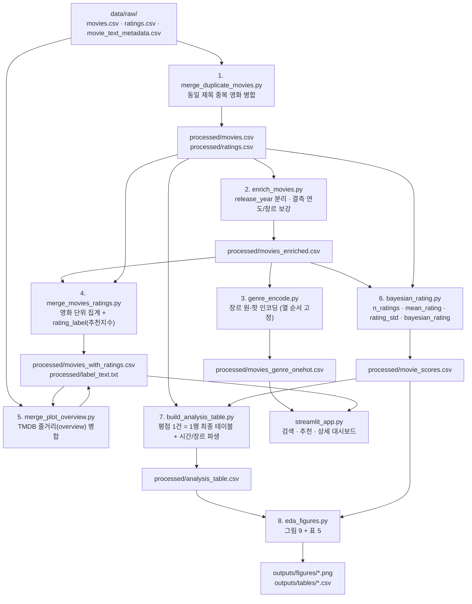

| 단계 | 스크립트 | 입력 → 출력 |
|---|---|---|
| 1 | `merge_duplicate_movies.py` | raw → `movies.csv`, `ratings.csv` |
| 2 | `enrich_movies.py` | `movies.csv` → `movies_enriched.csv` |
| 3 | `genre_encode.py` | `movies_enriched.csv` → `movies_genre_onehot.csv` |
| 4 | `merge_movies_ratings.py` | `movies_enriched.csv` + `ratings.csv` → `movies_with_ratings.csv`, `label_text.txt` |
| 5 | `merge_plot_overview.py` | `movies_with_ratings.csv` + raw `movie_text_metadata.csv` → `movies_with_ratings.csv`(+overview) |
| 6 | `bayesian_rating.py` | `ratings.csv` + `movies_enriched.csv` → `movie_scores.csv` |
| 7 | `build_analysis_table.py` | `ratings.csv` + `movie_scores.csv` → `analysis_table.csv` |
| 8 | `eda_figures.py` | `analysis_table.csv` + `movie_scores.csv` → `outputs/` |
| 앱 | `streamlit_app.py` | `movies_with_ratings.csv` + `movies_genre_onehot.csv` + `ratings.csv` + `label_text.txt` |

---

## 3. 프로젝트 구조

```
DA_Movielens-Rating-Explorer/
├── README.md
├── requirements.txt
├── run_all.py                       # 전체 파이프라인 오케스트레이터
├── streamlit_app.py                 # 영화 추천 탐색기 (검색·추천·상세)
├── CLAUDE.md                        # 작업 규칙
├── analysis/
│   ├── merge_duplicate_movies.py
│   ├── enrich_movies.py
│   ├── genre_encode.py              # 장르 원-핫 인코딩
│   ├── merge_movies_ratings.py
│   ├── merge_plot_overview.py       # TMDB 줄거리(overview) 병합
│   ├── genre_similarity.py          # 장르 코사인 유사도 CLI
│   ├── tfidf_overview.py            # 줄거리 TF-IDF 단어 점수 CLI
│   ├── tfidf_similarity.py          # TF-IDF vs 장르 벡터 유사도 비교 CLI
│   ├── bayesian_rating.py
│   ├── build_analysis_table.py
│   ├── eda_figures.py
│   └── capture_dashboard.py         # 대시보드 스크린샷 (playwright)
├── data/
│   ├── raw/                         # 원본 (수정 금지)
│   │   ├── movies.csv, ratings.csv, README.txt        (MovieLens ml-latest-small)
│   │   └── movie_text_metadata.csv, SOURCES.txt, …    (TMDB 줄거리/출연진, 강의 추가자료)
│   └── processed/                   # 가공본 (run_all.py 로 재생성, git 미포함)
│       └── favorites.json                              (개인 선호 목록, git 미포함)
└── outputs/
    ├── figures/                     # EDA 그림 9종
    ├── tables/                      # 표 5종
    └── screenshots/                 # 대시보드 캡처 8종
```

---

## 4. 데이터 정제

### 4-1. 초기 점검 (원본)

| 파일 | 행 | 결측 | 비고 |
|---|---|---|---|
| `movies.csv` | 9,742 | 없음 | `genres == "(no genres listed)"` 34건, 동일 제목·연도 중복 5쌍(10행) |
| `ratings.csv` | 100,836 | 없음 | 완전 중복 0, `(userId, movieId)` 중복 0, 평점 전부 0.5~5.0 |

### 4-2. 중복 영화 병합 (`merge_duplicate_movies.py`)

동일 제목·연도인데 `movieId`가 다른 5쌍을 **장르 개수가 많은 쪽을 대표로** 병합하고 `ratings`의 `movieId`도 치환했다.

```
병합 매핑 (drop -> keep): 6003->144606, 26958->838, 32600->147002, 168358->2851, 64997->34048
movies : 9742 -> 9737  (중복 5행 제거)
ratings: movieId 치환 20건
         치환 후 같은 (userId, movieId) 중복 8행 -> timestamp 최신 1건만 유지, 4행 제거
ratings: 100836 -> 100832
```

### 4-3. 연도·장르 보강 (`enrich_movies.py`)

- **`release_year` 분리**: 제목 끝 `(YYYY)` 를 정수 컬럼으로. `title`에서는 연도 제거.
  기간 표기 `(YYYY-YYYY)` 는 앞 연도 (예: `Death Note: Desu nôto (2006–2007)` → `2006`).
- **연도 결측 12건**: IMDb/Wikipedia 검색으로 추정치 입력, `year_estimated = True`.
- **장르 결측 34건**: 검색 후 **기존 19개 장르 범주 안에서만** 채우고 `genres_filled = True`.

```
연도 없음 12건 → 보강 12건, 남은 결측 0건
장르 없음 34건 → 보강 34건, 남은 '(no genres listed)' 0건
```

보강 내역과 근거는 `analysis/enrich_movies.py` 의 `ESTIMATED_YEAR` / `GENRE_FILL` 주석 참고.

### 4-4. TMDB 줄거리 병합 전 중복 점검 (`merge_plot_overview.py`)

`data/raw/movie_text_metadata.csv`(TMDB, 3,537편 커버)를 붙이기 전, 4-2에서 병합했던 동일-제목
중복 5쌍이 이 메타데이터에도 남아 있는지 확인했다.

| drop → keep | 메타데이터에 존재? | 조치 |
|---|---|---|
| 6003 → 144606 | **둘 다 존재**, 내용 동일(`tmdbId 4912`) | LEFT JOIN 특성상 기준 테이블에 없는 `6003`은 자동 무시 — 별도 remap 불필요 |
| 26958 → 838 / 32600 → 147002 / 168358 → 2851 | 둘 다 없음 | 해당 없음 |
| 64997 → 34048 | `34048`만 존재 | 해당 없음(충돌 없음) |

메타데이터 자체를 제목 기준으로 전수조사해도 이 한 쌍 외 추가 중복은 없다. 즉 **새로운 병합 작업은
필요 없고**, `movieId` 기준 LEFT JOIN만으로 안전하게 붙일 수 있다.

---

## 5. 파생변수

| 변수 | 정의 | 결측 처리 |
|---|---|---|
| `release_year` | 제목에서 분리한 개봉연도(정수). 범위 1902~2018 | 표기 없던 12건은 검색 추정 |
| `mean_rating` | 영화별 단순 평균 평점 (R) | 평가 없으면 공란 |
| `rating_count` | 영화별 평점 수 (v) | 평가 없으면 0 |
| `rating_std` | 영화별 평점의 표본표준편차(ddof=1). 호불호 지표 | 평점 ≤ 1건이면 공란 (3,459편) |
| `pos_ratio` | 4점 이상 평점의 비율 (0~1) | 평가 없으면 공란 |
| `bayesian_rating` | 아래 공식. m=10, C=3.5016 | 평가 없으면 C |
| `rating_label` | 추천지수 0~5 (아래 기준표) | 규칙으로 전 영화 부여 |

### 5-1. `bayesian_rating` — 베이지안 보정 평점

$$
\text{bayesian\_rating} = \frac{v \cdot R + m \cdot C}{v + m}
$$

- $R$ = `mean_rating`, $v$ = `rating_count`, $C$ = 전역 평균 3.5016, $m$ = 10
- "평균이 $C$인 가상 평점 $m$개가 이미 달려 있다"고 보고 실제 평점과 합쳐 평균.
- $v \to 0$이면 $C$로 수렴, $v \gg m$이면 $R$ 유지. $m=10$은 영화별 평점 수의 평균(약 10.4)에 맞춘 값.

### 5-2. `rating_label` — 추천지수 기준표

위에서부터 순서대로 검사하고 **처음 해당하는 값으로 확정**한다. 라벨 이름은 `data/processed/label_text.txt` 에 별도 저장.

| 값 | 라벨 | 기준 (rc = rating_count) |
|---|---|---|
| 0 | 평가 없음 | rc == 0 |
| 1 | 평가 부족 | rc < 30 |
| 2 | 대다수가 좋아하는 영화 | rc ≥ 30 **&** pos_ratio ≥ 0.65 **&** rating_std < 0.95 |
| 3 | 호불호가 갈리는 영화 | rc ≥ 30 **&** rating_std ≥ 1.05 |
| 4 | 무난하게 좋은 영화 | rc ≥ 30 **&** pos_ratio ≥ 0.45 |
| 5 | 대다수가 아쉬워한 영화 | rc ≥ 30 **&** 나머지 전부 (pos_ratio < 0.45) |

분포:

| 값 | 라벨 | 영화 수 | 비율 |
|---|---|---|---|
| 0 | 평가 없음 | 18 | 0.2% |
| 1 | 평가 부족 | 8,837 | 90.8% |
| 2 | 대다수가 좋아하는 영화 | 180 | 1.8% |
| 3 | 호불호가 갈리는 영화 | 134 | 1.4% |
| 4 | 무난하게 좋은 영화 | 326 | 3.3% |
| 5 | 대다수가 아쉬워한 영화 | 242 | 2.5% |

- **2** 예시: Forrest Gump, Shawshank Redemption, Silence of the Lambs, Star Wars IV
- **3** 예시: Titanic, Star Wars 에피소드 I, Ace Ventura, Dumb & Dumber (rating_std ≥ 1.05)

### 5-3. `analysis_table.csv` 추가 파생 열
`rating_dt`(timestamp→datetime), `rating_year`, `movie_age`(= `rating_year - release_year`), `n_genres`, `primary_genre`.

---

## 6. 결과 데이터 (`data/processed/`, `run_all.py` 로 재생성)

| 파일 | 행 × 열 | 크기 | 핵심 컬럼 |
|---|---|---|---|
| `movies.csv` | 9,737 × 3 | 483 KB | movieId, title, genres |
| `ratings.csv` | 100,832 × 4 | 2.4 MB | userId, movieId, rating, timestamp |
| `movies_enriched.csv` | 9,737 × 6 | 578 KB | + release_year, year_estimated, genres_filled |
| `movies_genre_onehot.csv` | 9,737 × 23 | 825 KB | movieId, title, release_year, genres + 장르 19개 원-핫(0/1, 열 순서 고정) |
| `movies_with_ratings.csv` | 9,737 × 11 | 1.7 MB | + mean_rating, rating_count, rating_std, bayesian_rating, pos_ratio, **rating_label**, **overview**(TMDB 줄거리, 3,536편만 존재) |
| `movie_scores.csv` | 9,737 × 8 | 643 KB | + n_ratings, mean_rating, rating_std, bayesian_rating |
| `analysis_table.csv` | 100,832 × 16 | 12.7 MB | 평점 1건 = 1행. 위 전부 + rating_dt/rating_year/movie_age/n_genres/primary_genre |

`analysis_table.csv` 상위 5행:

```
 userId  movieId              title  release_year                                      genres primary_genre  n_genres  rating           rating_dt  rating_year  movie_age  n_ratings  mean_rating  rating_std  bayesian_rating
      1        1          Toy Story          1995 Adventure|Animation|Children|Comedy|Fantasy     Adventure         5     4.0 2000-07-30 18:45:03         2000          5        215       3.9209      0.8349           3.9023
      1        3   Grumpier Old Men          1995                              Comedy|Romance        Comedy         2     4.0 2000-07-30 18:20:47         2000          5         52       3.2596      1.0548           3.2986
      1        6               Heat          1995                       Action|Crime|Thriller        Action         3     4.0 2000-07-30 18:37:04         2000          5        102       3.9461      0.8172           3.9064
      1       47 Seven (a.k.a. Se7en)          1995                            Mystery|Thriller       Mystery         2     5.0 2000-07-30 19:03:35         2000          5        203       3.9754      0.9224           3.9531
      1       50 Usual Suspects, The          1995                      Crime|Mystery|Thriller         Crime         3     5.0 2000-07-30 18:48:51         2000          5        204       4.2377      0.8009           4.2033
```

수치형 요약 (`analysis_table.csv`, 100,832행):

| 열 | mean | std | min | 25% | 50% | 75% | max |
|---|---|---|---|---|---|---|---|
| rating | 3.502 | 1.043 | 0.5 | 3.0 | 3.5 | 4.0 | 5.0 |
| release_year | 1994.4 | 14.4 | 1902 | 1990 | 1997 | 2003 | 2018 |
| rating_year | 2007.7 | 6.9 | 1996 | 2002 | 2007 | 2015 | 2018 |
| movie_age | 13.3 | 13.9 | -1 | 3 | 9 | 18 | 116 |
| n_genres | 2.72 | 1.19 | 1 | 2 | 3 | 3 | 10 |
| n_ratings | 58.8 | 62.0 | 1 | 13 | 39 | 84 | 329 |
| mean_rating | 3.502 | 0.565 | 0.5 | 3.185 | 3.576 | 3.917 | 5.0 |
| rating_std | 0.896 | 0.216 | 0.0 | 0.791 | 0.898 | 1.011 | 3.182 |
| bayesian_rating | 3.550 | 0.345 | 2.259 | 3.334 | 3.546 | 3.805 | 4.401 |

---

## 7. EDA 그림 (`outputs/figures/`)

### 01. 평점 값 분포
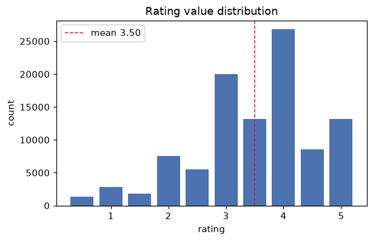
정수점(3·4·5)이 반점보다 훨씬 많다 — 사용자가 정수 평점을 선호. 좌편향(낮은 점수가 적음), 최빈값 4.0.

### 02. 연도별 평점 수
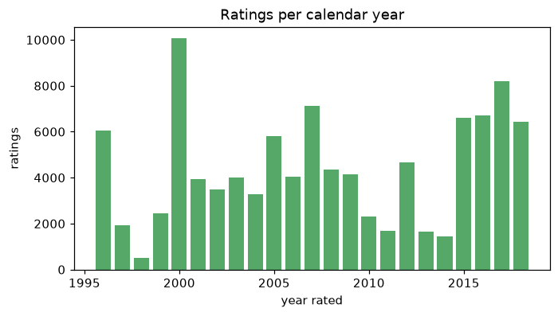
1996·2000·2005·2007, 그리고 2015~2018에 활동이 몰림. 데이터가 20여 년에 걸쳐 불균등 수집.

### 03. 개봉연도(10년 단위) 분포
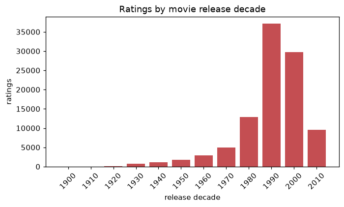
평점 기준 1990년대(약 37,000건)·2000년대(약 30,000건) 영화에 집중.

### 04. primary_genre 분포
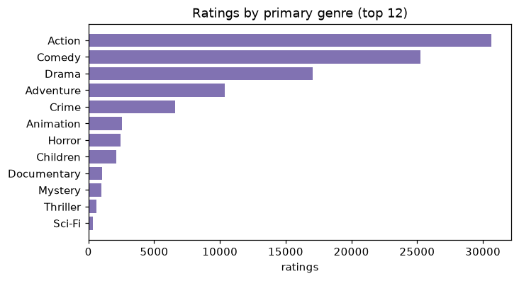
첫 장르 기준 Action > Comedy > Drama. Action·Comedy가 전체 평점의 절반 이상.

### 05. 축소(shrinkage) 효과
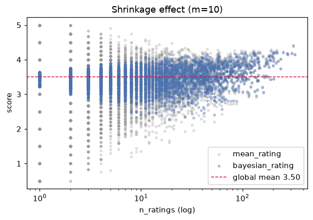
`n_ratings`(로그축) 대비 `mean_rating`(회색)과 `bayesian_rating`(파랑).
표본이 적은 왼쪽에서 파란 점이 전역 평균 3.50으로 강하게 당겨지고, `n_ratings`가 20~50을 넘으면 두 값이 겹친다. `m=10`이 의도대로 작동함을 보여준다.

### 06. 호불호 지도
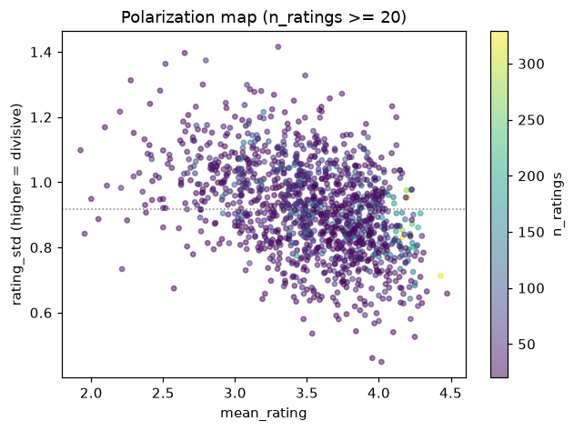
`n_ratings ≥ 20` 영화의 `mean_rating`(x) vs `rating_std`(y), 색은 평점 수.
오른쪽 아래(고평점·저편차)가 "안전한 호평작", 가운데 위쪽(중간 평점·고편차)이 "논쟁작".

### 07. Top 15 단순평균 vs 보정평균
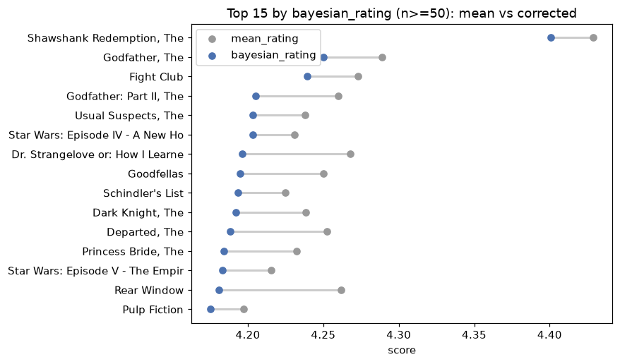
`bayesian_rating` 상위 15편(`n_ratings ≥ 50`)에서 회색(단순평균)과 파랑(보정평균)의 간격 = 축소 폭. 표본이 적을수록 간격이 크다.

### 08. 장르별 평점량 vs 보정평균
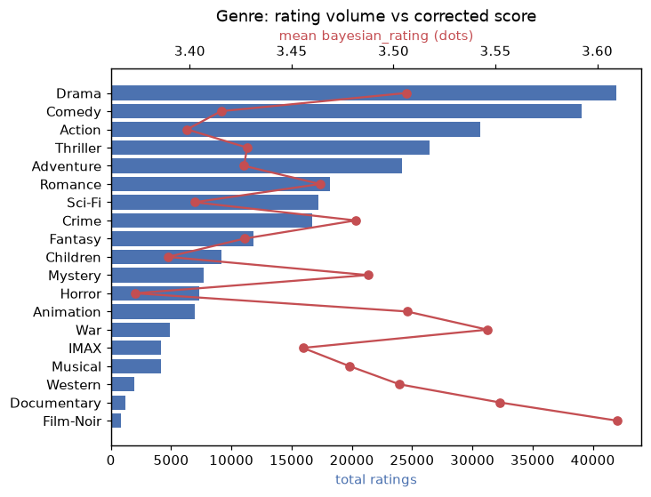
막대 = 장르별 총 평점 수, 점 = 장르별 평균 `bayesian_rating`.
Drama·Comedy·Action은 물량이 많지만 평균 보정평점은 중간, Film-Noir·Documentary·War는 물량은 적어도 평균 보정평점이 높다.

### 09. 추천 후보 (보정평점 높음 + 표준편차 낮음)
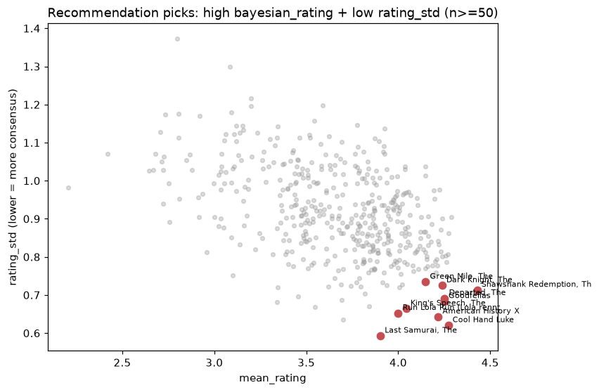
`n_ratings ≥ 50` 영화 중 복합점수 `z(bayesian_rating) - z(rating_std)` 상위 10편을 빨강으로 표시. 전부 오른쪽 아래(고평점·저편차)에 위치하며 Crime|Drama 계열이 많다.

---

## 8. 대시보드 — 영화 추천 탐색기 (`streamlit_app.py`)

`streamlit run streamlit_app.py` 로 실행. 화면은 **🔸 개인화 추천**과 **🔹 비개인화 추천**
두 영역으로 명확히 나뉜다.

| | 🔸 개인화 추천 | 🔹 비개인화 추천 |
|---|---|---|
| 위치 | 페이지 맨 위, 항상 표시(영화 선택 여부 무관) | 영화를 선택했을 때, 상세 화면 아래 |
| 기준 | 내가 담은 선호 영화 목록 | 지금 보고 있는 영화 하나 |
| 특징 | 선호 목록이 다르면 결과도 다름(사람마다 다름) | 같은 영화를 보면 누구에게나 같은 결과 |
| 포함 | 선호 장르 프로필(10점), 장르 벡터 기반 추천, 줄거리 기반(TF-IDF) 추천 | 같은 장르 추천(평점·인기도·보정평점), 비슷한 장르의 영화(코사인 유사도) |

### 8-1. 제목·장르 검색
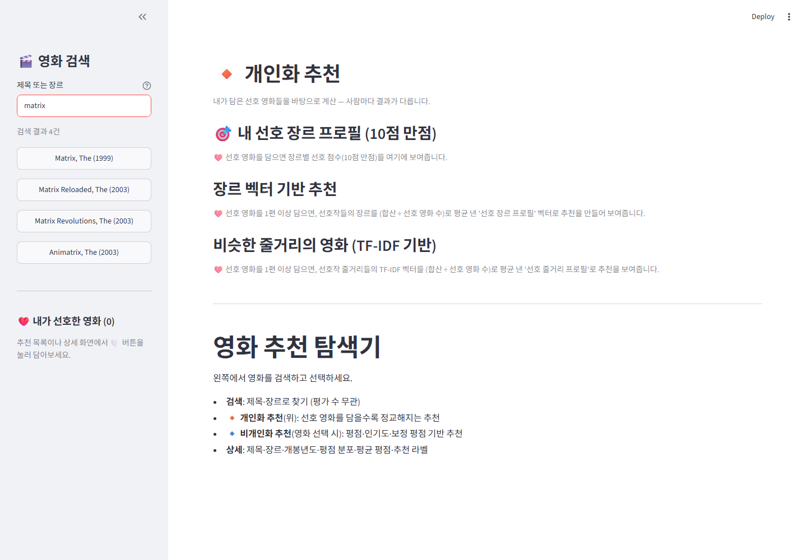
검색어를 **제목과 장르(genres) 양쪽에 부분일치**로 찾는다. 평가 수와 무관하게 전체 9,737편이 대상이다.
`matrix` → Matrix / Reloaded / Revolutions / Animatrix. 결과는 버튼 목록으로 뜨고 클릭하면 선택된다.

### 8-2. 영화 상세 + 🔹 비개인화: 같은 장르 추천

- **상세**: 제목 · 개봉년도 · 장르, 평균 평점 / 평점 수 / 보정 평점, 추천 라벨(색상 + 근거 설명),
  그리고 **평점 분포 막대그래프 (0.5 ~ 5.0)** — 해당 영화가 받은 평점의 히스토그램.
- **🔹 같은 장르에서 추천할 만한 영화**(비개인화): 선택한 영화와 장르가 하나라도 겹치는 영화를
  `bayesian_rating`(보정 평점) 내림차순으로 나열 — 평점·인기도·보정평점만 쓰고 선호 목록은 안 쓴다.
  각 항목에 보정평점·평균·평가수·`rating_label`·공통 장르를 표시하고, 클릭하면 그 영화로 이동해 연쇄 탐색이 가능하다.
  옵션으로 "평가 30건 이상만 보기", 표시 개수(5~30)를 조절.
  예: Matrix, The → Fight Club, Usual Suspects, Star Wars IV, Dark Knight …

### 8-3. 장르로 검색
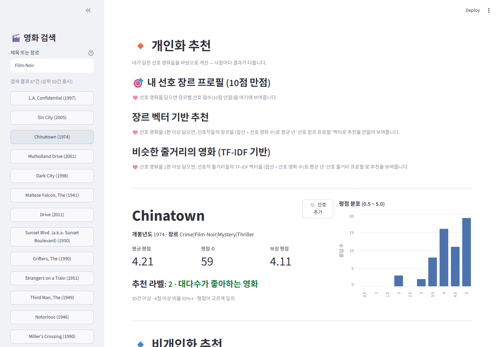
`Film-Noir` 로 검색하면 그 장르의 영화 87편이 나오고, Chinatown 선택 시 같은 장르(Crime·Film-Noir·Mystery·Thriller)에서
Shawshank Redemption · Godfather · Fight Club 순으로 추천된다.

### 8-4. 선호 영화 담기
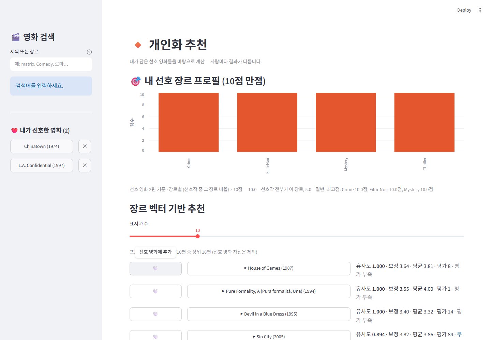
상세 화면 제목 옆과 추천 리스트 각 항목 왼쪽에 하트 버튼(🤍/❤️)이 있다. 누르면 그 영화가
**선호 영화**로 담기고, 왼쪽 사이드바 "❤️ 내가 선호한 영화 (N)"에 실시간으로 쌓이며, 위쪽
**🔸 개인화 추천 영역**이 그 선호 목록을 기준으로 다시 계산된다. 목록의 각 항목을 클릭하면
그 영화 상세로 바로 이동하고, `✕`로 개별 제거할 수 있다.

**저장**: 하트를 누를 때마다 `data/processed/favorites.json` 에 즉시 기록되어,
브라우저를 새로고침하거나 앱(서버)을 재시작해도 목록이 유지된다.

```json
{
  "updated_at": "2026-09-12T11:43:11",
  "favorites": [{"movieId": 1, "title": "Toy Story"}]
}
```

이 앱은 로컬에서 혼자 실행하는 걸 전제로 하므로 파일 저장을 택했다 — 여러 사람이 같은 URL로
접속하는 배포 환경이라면 이 방식은 모든 방문자가 하나의 목록을 공유하게 되므로 맞지 않고,
방문자별로 격리되는 브라우저 저장(localStorage)이 필요하다.
`favorites.json`은 개인 데이터라 `.gitignore`로 제외해 저장소에는 올라가지 않는다.

### 8-5. 🔹 비개인화: 비슷한 장르의 영화 (코사인 유사도)
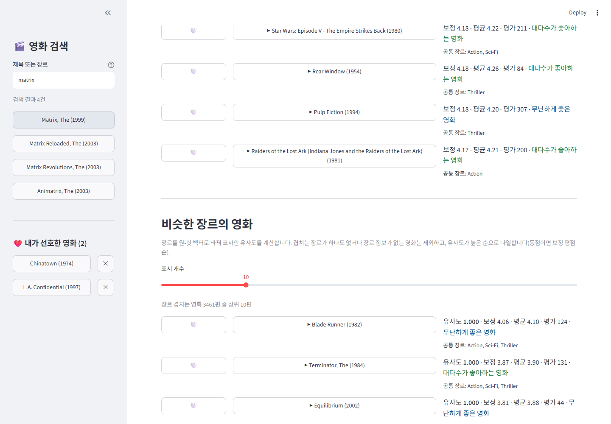
`movies_genre_onehot.csv` 의 장르 원-핫 벡터로 **지금 선택한 영화**와 다른 모든 영화의 **코사인 유사도**를
계산해 높은 순으로 나열한다 (`analysis/genre_similarity.py` CLI와 같은 계산을 앱에 내장한 것). 선호 목록을
전혀 쓰지 않으므로 비개인화 영역에 속한다.

- **제외 규칙**: 겹치는 장르가 하나도 없는 영화(코사인 유사도 = 0)와 장르 정보가 없는 영화는 목록에서 뺀다.
- **동점 처리**: 유사도가 같으면(예: 장르 조합이 완전히 동일) `bayesian_rating` 내림차순으로 정렬한다.
- 8-2 절의 "같은 장르에서 추천"이 *장르가 하나라도 겹치면* `bayesian_rating` 순으로 보여주는 반면,
  이 섹션은 *장르 벡터가 얼마나 닮았는지*(코사인 유사도)를 1차 기준으로 삼는다는 점이 다르다.
- 예: Matrix, The(Action\|Sci-Fi\|Thriller) → 정확히 같은 3장르 조합인 Blade Runner·Terminator·Equilibrium 등이
  전부 유사도 1.000으로 묶이고, 그중 보정 평점이 가장 높은 **Blade Runner(4.06)** 가 1위로 온다.

### 8-6. 🔸 개인화: 장르 벡터 기반 추천
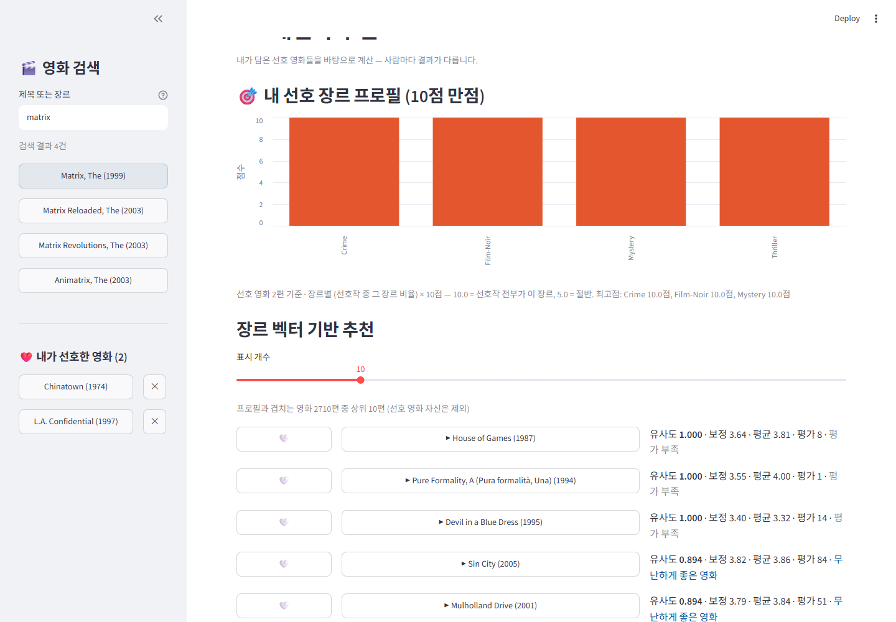
선호 영화가 **여러 편**이면 개별 영화 하나로는 대표할 수 없으므로, 선호작들의 장르 원-핫 벡터를
**전부 합산한 뒤 선호 영화 수로 나눠** "선호 장르 프로필" 벡터를 만든다 — 각 장르 열은
"그 장르를 가진 선호작의 비율"이 된다(예: 선호작 2편 중 1편만 Drama면 Drama = 0.5).
이 프로필 벡터로 전체 영화와 코사인 유사도를 계산해 순위를 매긴다. 지금 어떤 영화를 보고 있는지와
무관하게 **선호 목록만으로** 계산되므로 개인화 영역에 속한다.

- **적용 대상**: 특정 영화를 보고 있지 않아도(첫 화면) 항상 표시되며, 영화 상세 위쪽에도 동일하게 나온다.
- **제외 규칙**: 8-5와 동일 — 유사도 0(겹치는 장르 없음/장르 정보 없음) 제외 + **이미 선호한 영화 자신은 목록에서 제외**.
- **동점 처리**: `bayesian_rating` 내림차순.
- 예: `Chinatown`(Crime·Film-Noir·Mystery·Thriller) + `Shawshank Redemption`(Crime·Drama)을 선호하면
  프로필은 `Crime 100%, Drama/Film-Noir/Mystery/Thriller 각 50%`가 되고, 이 조합과 가장 가까운
  `Mulholland Drive`(Crime·Drama·Mystery·Thriller, 유사도 0.949)가 1위로 추천된다.
- 선호 영화 0편이면 프로필을 만들 수 없다는 안내만 표시한다.

### 8-7. 🔸 개인화: 비슷한 줄거리의 영화 (TF-IDF 기반)
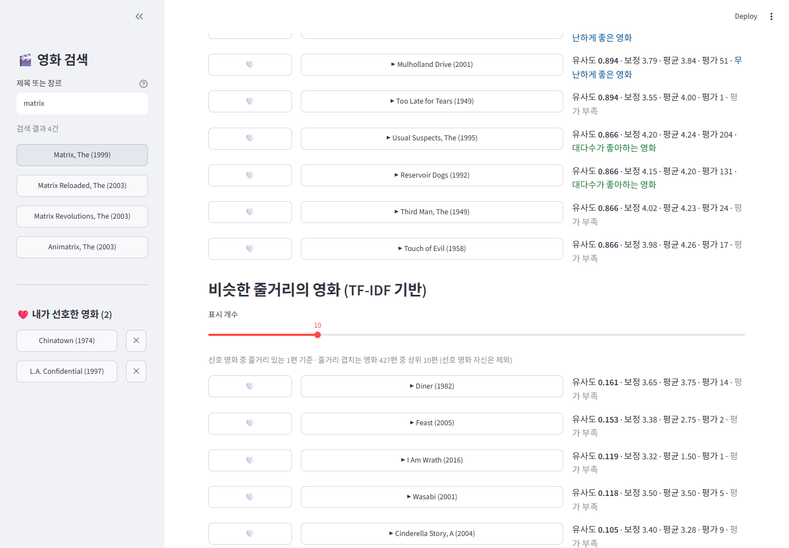
장르 대신 **줄거리(overview)** 로 만드는 개인화 추천. 선호작들의 TF-IDF 벡터를 (장르 프로필과 똑같은 방식으로)
합산 후 선호 영화 수로 나눠 "선호 줄거리 프로필"을 만들고, 전체 영화와 코사인 유사도를 계산한다.

- **제외 규칙**: 8-6과 동일 — 줄거리가 하나도 안 겹치는 영화(유사도 0), 줄거리 정보가 없는 영화, 선호 영화
  자신은 제외. 선호작 중 줄거리가 없는 편은 프로필 계산에서 자동으로 빠지고 몇 편이 쓰였는지 캡션에 표시한다.
- **동점 처리**: `bayesian_rating` 내림차순.
- **TF-IDF 계산은 앱 실행 중 단 한 번만 한다.** `build_tfidf()` 가 `@st.cache_data` 로 캐시되어,
  표시 개수를 바꾸거나 다른 영화를 보거나 추천 목록을 다시 그려도 **재계산되지 않는다** — 캐시는
  `movies_with_ratings.csv`(movieId·overview) 내용이 실제로 바뀔 때(=새 영화/줄거리 추가, 곧 앱 재시작)만
  갱신된다. 영어 불용어는 제외하고(`TfidfVectorizer(stop_words="english")`), 동일한 overview 텍스트가
  여러 movieId 에 걸쳐 있으면 IDF 왜곡을 막기 위해 한 번만 코퍼스에 넣는다.
- 예: `Chinatown` + `L.A. Confidential` 선호 시 Mulholland Drive·Usual Suspects·Reservoir Dogs·Third Man
  같은 범죄/느와르 작품이 유사도 0.86~0.89 로 상위에 온다.

### 8-8. 🔸 개인화: 내 선호 장르 프로필 (10점 만점)
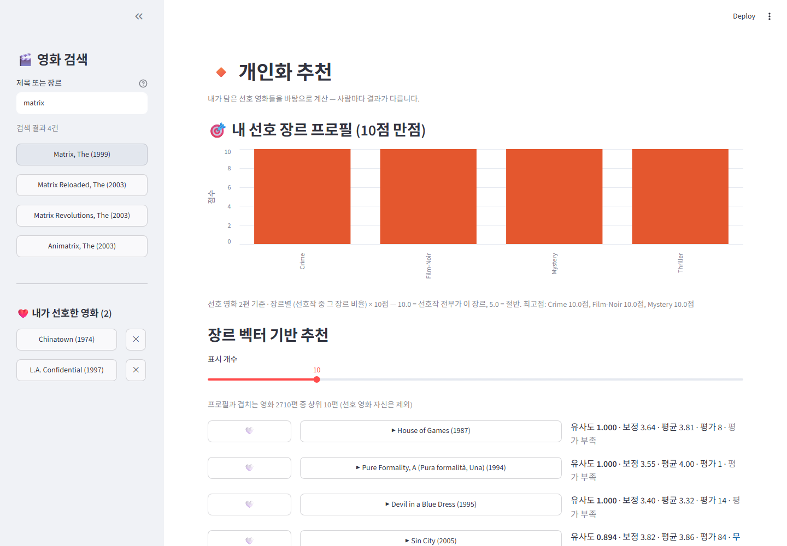
8-6의 프로필 벡터(장르별 0~1 비율)를 **10점 만점 점수(비율 × 10)** 로 바꿔 막대그래프로 보여준다.
🔸 개인화 추천 영역의 맨 위, 즉 페이지 최상단에 항상 표시된다.

- 점수 = (그 장르를 가진 선호작 수 ÷ 선호 영화 수) × 10. 10.0 = 선호작 전부가 그 장르, 5.0 = 절반.
- 예: `Chinatown`(Crime·Film-Noir·Mystery·Thriller) + `Shawshank Redemption`(Crime·Drama) 선호 시
  `Crime 10.0점`, `Drama·Film-Noir·Mystery·Thriller 각 5.0점`.
- 선호 영화가 없으면 담아보라는 안내만 표시하고 차트는 그리지 않는다.

---

## 9. 표 (`outputs/tables/`)

### 9-1. `top20_by_bayesian.csv` — 보정 평점 상위

| title | year | n_ratings | mean | std | bayesian |
|---|---|---|---|---|---|
| Shawshank Redemption, The | 1994 | 317 | 4.429 | 0.713 | 4.401 |
| Godfather, The | 1972 | 192 | 4.289 | 0.904 | 4.250 |
| Fight Club | 1999 | 218 | 4.273 | 0.861 | 4.239 |
| Godfather: Part II, The | 1974 | 129 | 4.260 | 0.803 | 4.205 |
| Usual Suspects, The | 1995 | 204 | 4.238 | 0.801 | 4.203 |
| Star Wars: Episode IV | 1977 | 251 | 4.231 | 0.872 | 4.203 |
| Dr. Strangelove | 1964 | 97 | 4.268 | 0.807 | 4.196 |
| Goodfellas | 1990 | 126 | 4.250 | 0.683 | 4.195 |
| Schindler's List | 1993 | 220 | 4.225 | 0.976 | 4.194 |
| Dark Knight, The | 2008 | 149 | 4.238 | 0.725 | 4.192 |

(전체 20행 CSV. 11~20위: Departed / Princess Bride / Star Wars V / Rear Window / Pulp Fiction / Raiders of the Lost Ark / Casablanca / Matrix / American History X / Apocalypse Now)

### 9-2. `most_rated_top20.csv` — 평점 수(인기) 상위

| title | year | n_ratings | mean | bayesian |
|---|---|---|---|---|
| Forrest Gump | 1994 | 329 | 4.164 | 4.145 |
| Shawshank Redemption, The | 1994 | 317 | 4.429 | 4.401 |
| Pulp Fiction | 1994 | 307 | 4.197 | 4.175 |
| Silence of the Lambs, The | 1991 | 279 | 4.161 | 4.139 |
| Matrix, The | 1999 | 278 | 4.192 | 4.169 |
| Star Wars: Episode IV | 1977 | 251 | 4.231 | 4.203 |
| Jurassic Park | 1993 | 238 | 3.750 | 3.740 |
| Braveheart | 1995 | 237 | 4.032 | 4.010 |
| Terminator 2: Judgment Day | 1991 | 224 | 3.971 | 3.951 |
| Schindler's List | 1993 | 220 | 4.225 | 4.194 |

1994년 전후 대형 흥행작. 표본이 많아 `mean ≈ bayesian`.

### 9-3. `most_polarizing_n50.csv` — 호불호 큰 영화 (`n_ratings ≥ 50`, `rating_std` 상위)

| title | year | n_ratings | mean | std |
|---|---|---|---|---|
| Blair Witch Project, The | 1999 | 64 | 2.797 | 1.374 |
| First Knight | 1995 | 54 | 3.083 | 1.299 |
| Austin Powers: The Spy Who Shagged Me | 1999 | 121 | 3.198 | 1.215 |
| Moulin Rouge | 2001 | 55 | 3.591 | 1.198 |
| Scream | 1996 | 70 | 3.200 | 1.196 |
| Mars Attacks! | 1996 | 86 | 3.093 | 1.180 |
| Cable Guy, The | 1996 | 54 | 2.806 | 1.175 |
| Nutty Professor, The | 1996 | 82 | 2.732 | 1.174 |
| Scary Movie | 2000 | 50 | 2.920 | 1.171 |
| Rushmore | 1998 | 56 | 3.545 | 1.157 |

코미디·호러, 그리고 Star Wars 프리퀄이 자주 등장. 평균은 중간인데 편차가 커서 "취향을 크게 타는" 영화들.

### 9-4. `consensus_praised_n50.csv` — 평가 일치 호평작 (`n_ratings ≥ 50`, `mean ≥ 4`, `rating_std` 하위)

| title | year | n_ratings | mean | std |
|---|---|---|---|---|
| Cool Hand Luke | 1967 | 57 | 4.272 | 0.620 |
| American History X | 1998 | 129 | 4.217 | 0.643 |
| Run Lola Run | 1998 | 75 | 4.000 | 0.652 |
| King's Speech, The | 2010 | 58 | 4.043 | 0.664 |
| Goodfellas | 1990 | 126 | 4.250 | 0.683 |
| Departed, The | 2006 | 107 | 4.252 | 0.692 |
| Shawshank Redemption, The | 1994 | 317 | 4.429 | 0.713 |
| Stand by Me | 1986 | 91 | 4.006 | 0.721 |
| Dark Knight, The | 2008 | 149 | 4.238 | 0.725 |
| The Imitation Game | 2014 | 50 | 4.020 | 0.728 |

Crime|Drama 계열에 강하게 쏠린다 — 진지한 범죄/인간 드라마가 관객 이견이 가장 적다.

### 9-5. `genre_summary.csv` — 장르별 요약 (다중 장르는 explode, 19개 전체)

| genre | n_movies | total_ratings | mean_of_mean | mean_bayesian | mean_std |
|---|---|---|---|---|---|
| Drama | 4364 | 41948 | 3.422 | 3.506 | 0.794 |
| Comedy | 3766 | 39075 | 3.181 | 3.415 | 0.892 |
| Action | 1832 | 30644 | 3.092 | 3.399 | 0.883 |
| Thriller | 1890 | 26456 | 3.158 | 3.428 | 0.829 |
| Adventure | 1267 | 24173 | 3.213 | 3.427 | 0.872 |
| Romance | 1595 | 18144 | 3.364 | 3.464 | 0.851 |
| Sci-Fi | 982 | 17245 | 3.106 | 3.402 | 0.883 |
| Crime | 1201 | 16689 | 3.304 | 3.481 | 0.793 |
| Fantasy | 782 | 11845 | 3.221 | 3.427 | 0.879 |
| Children | 665 | 9209 | 3.109 | 3.389 | 0.904 |
| Mystery | 578 | 7680 | 3.341 | 3.487 | 0.820 |
| Horror | 978 | 7294 | 2.919 | 3.373 | 0.892 |
| Animation | 612 | 6990 | 3.496 | 3.507 | 0.859 |
| War | 382 | 4860 | 3.568 | 3.546 | 0.788 |
| IMAX | 158 | 4145 | 3.312 | 3.456 | 0.897 |
| Musical | 338 | 4144 | 3.288 | 3.478 | 0.851 |
| Western | 167 | 1930 | 3.383 | 3.503 | 0.801 |
| Documentary | 444 | 1225 | 3.772 | 3.552 | 0.637 |
| Film-Noir | 85 | 870 | 3.670 | 3.610 | 0.742 |

---

## 10. 추천 리스트 (요약 산출물)

### ① 많이 본 영화 (인기)
`most_rated_top20.csv` — Forrest Gump, Shawshank Redemption, Pulp Fiction, Silence of the Lambs, Matrix …

### ② 보정 평점 높고 평가 일치 (실패 확률 낮은 추천)
`n_ratings ≥ 50` 필터 후 복합점수 `z(bayesian_rating) - z(rating_std)` 상위 10편.

| # | title | year | genres | n_ratings | bayesian | std |
|---|---|---|---|---|---|---|
| 1 | Cool Hand Luke | 1967 | Drama | 57 | 4.16 | 0.62 |
| 2 | Shawshank Redemption, The | 1994 | Crime\|Drama | 317 | 4.40 | 0.71 |
| 3 | American History X | 1998 | Crime\|Drama | 129 | 4.17 | 0.64 |
| 4 | Goodfellas | 1990 | Crime\|Drama | 126 | 4.20 | 0.68 |
| 5 | Departed, The | 2006 | Crime\|Drama\|Thriller | 107 | 4.19 | 0.69 |
| 6 | Last Samurai, The | 2003 | Action\|Adventure\|Drama\|War | 62 | 3.85 | 0.59 |
| 7 | Dark Knight, The | 2008 | Action\|Crime\|Drama\|IMAX | 149 | 4.19 | 0.73 |
| 8 | Run Lola Run | 1998 | Action\|Crime | 75 | 3.94 | 0.65 |
| 9 | King's Speech, The | 2010 | Drama | 58 | 3.96 | 0.66 |
| 10 | Green Mile, The | 1999 | Crime\|Drama | 111 | 4.10 | 0.73 |

### ③ 대시보드
장르 기반 실시간 추천 — 8장 참고.

---

## 11. 한계

- **장르 보강 34건 · 연도 추정 12건은 단일 출처(IMDb/Wikipedia) 판단**이다. 2차 검증이 없고,
  TV 시리즈(Black Mirror, The OA, Babylon 5 등)의 `release_year`는 시리즈 시작연도라 "영화 개봉연도"와 개념이 이질적이다. `year_estimated` / `genres_filled` 플래그로 구분 가능.
- **`analysis_table.csv`는 기술 분석용이다.** `mean_rating` · `bayesian_rating` · `rating_std`가
  전체 기간 평점으로 계산되므로 예측 모델 학습에 그대로 쓰면 미래 정보 누수. 예측용이면 시점 기준 재계산 필요.
- `rating_label` 임계값(pos_ratio 0.45 / 0.65, rating_std 0.95 / 1.05)은 이 데이터에 맞춰 조정한 값이다. 스크립트 상단에서 바꿀 수 있다.
- `movie_age` 음수 3건(개봉 직전 평가/데이터 불일치)이 남아 있다.
- 추천은 **장르 겹침 + 보정 평점 랭킹**까지다. 협업 필터링·콘텐츠 임베딩은 포함하지 않았다.
- `tags.csv` · `links.csv`는 이 실습 데이터에 없어 사용하지 않았다.
- `data/processed/` 는 `.gitignore` 대상이라 대시보드 배포 시 `python run_all.py` 를 먼저 실행해야 한다.

---

## 12. 데이터 출처 · 라이선스

MovieLens `ml-latest-small` (GroupLens Research, University of Minnesota) — <https://grouplens.org/datasets/movielens/>.
F. Maxwell Harper and Joseph A. Konstan. 2015. *The MovieLens Datasets: History and Context.* ACM TiiS 5, 4.
원본 데이터의 이용 조건은 `data/raw/README.txt` 참고.
